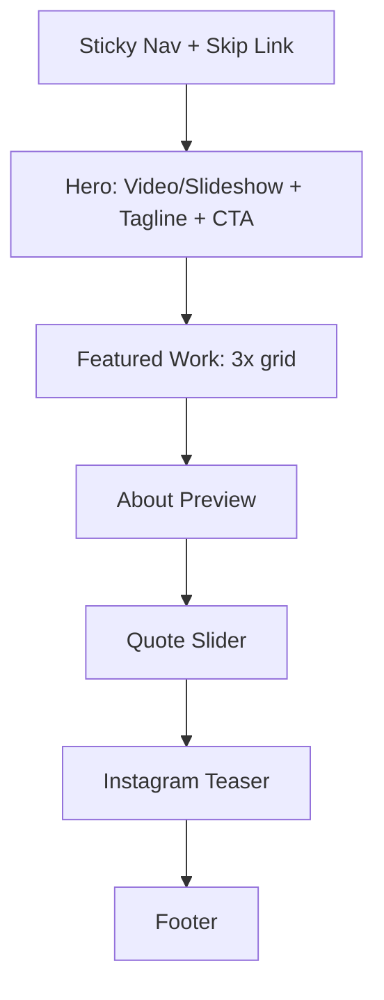
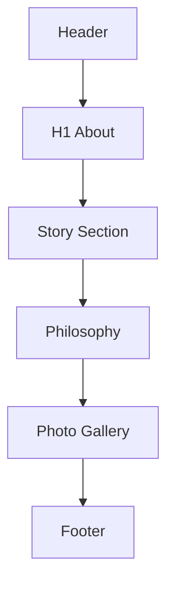
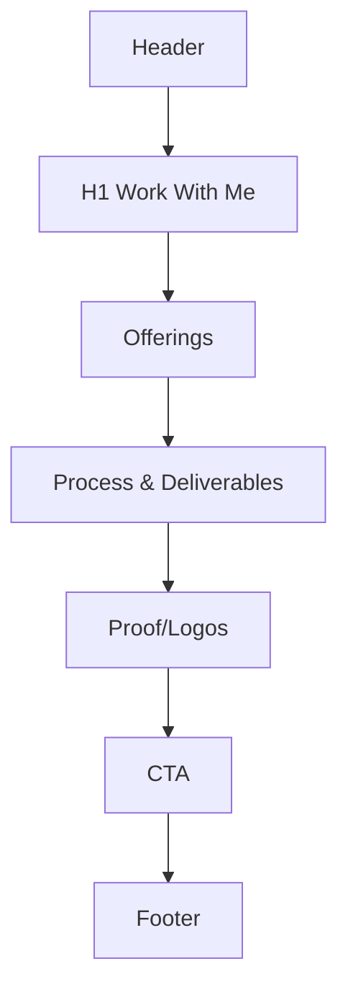
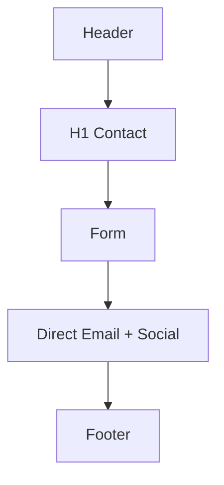

# Low-Fidelity Wireframes (Textual/Diagram Drafts)

These are structural drafts to guide visual design. Final hi-fi will follow after feedback.

## Home Layout



## About Layout



## Portfolio Layout

```mermaid
flowchart TB
  A[Header]
  B[H1 Portfolio]
  C[Filter Controls]
  D[Grid]
  E[Lightbox (modal overlay)]
  F[Footer]
  A-->B-->C-->D-->F
  D--Open-->E
```

## Work With Me Layout



## Contact Layout


