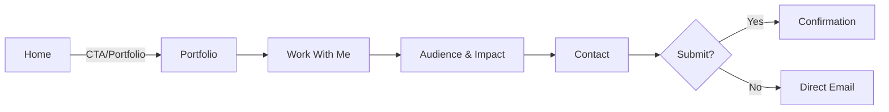
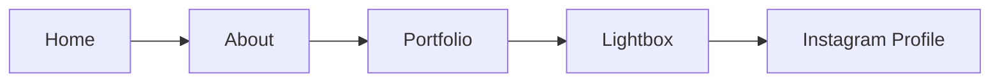
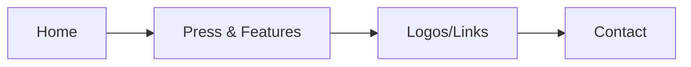

# User Flows (Draft)

## Flow A: Brand Manager → Inquiry

## Flow B: Follower → Social Engage

## Flow C: PR Editor → Contact

Notes

- Sticky nav and footer provide cross-links at every step.
- Ensure visible focus and logical tab order throughout.
